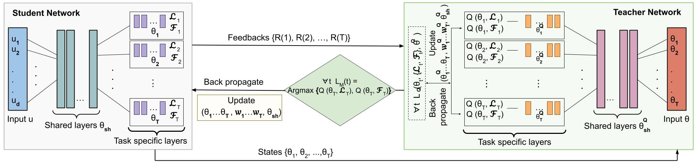

[Arjun Roy](https://www.mi.fu-berlin.de/en/inf/groups/ag-KIML/members/Scientific-Staff/Roy/index.html) and [Eirini Ntoutsi](https://www.mi.fu-berlin.de/inf/groups/ag-KIML/members/Professoren/Ntoutsi.html)

[Paper](https://arxiv.org/pdf/2206.08403v1.pdf), [Code](https://github.com/arjunroyihrpa/L2TFMT)

## Abstract

Fairness-aware learning mainly focuses on single task learning (STL). The fairness implications of multi-task learning (MTL) have only recently been considered and a seminal approach has been proposed that considers the fairness-accuracy trade-off for each task and the performance trade-off among different tasks. Instead of a rigid fairness-accuracy trade-off formulation, we propose a flexible approach that learns how to be fair in a MTL setting by selecting which objective (accuracy or fairness) to optimize at each step. We introduce the L2T-FMT algorithm that is a teacher-student network trained collaboratively; the student learns to solve the fair MTL problem while the teacher instructs the student to learn from either accuracy or fairness, depending on what is harder to learn for each task. Moreover, this dynamic selection of which objective to use at each step for each task reduces the number of trade-off weights from 2T to T , where T is the number of tasks. Our experiments on three real datasets show that L2T-FMT improves on both fairness (12-19%) and accuracy (up to 2%) over state-of-the-art approaches.

### Publication

This paper was accepted at [ECML-PKDD 2022](https://2022.ecmlpkdd.org/) (European Conference on Machine Learning and Principles and Practice of Knowledge Discovery in Databases 2022).
 
### Contact Information

<i class="fa-solid fa-envelope"></i>[E-mail](mailto:arjun.roy@fu-berlin.de), <i class="fa-brands fa-github-square"></i>[GitHub](https://github.com/arjunroyihrpa/L2TFMT), <i class="fa-brands fa-linkedin"></i>[LinkedIn](https://www.linkedin.com/in/arjun-roy-fub/), <i class="fa-brands fa-twitter-square"></i>[Twitter](https://twitter.com/Arjun7389), <i class="fa-solid fa-graduation-cap"></i>[Google Scholar](https://scholar.google.de/citations?user=HJ0FBh4AAAAJ&hl=en)

